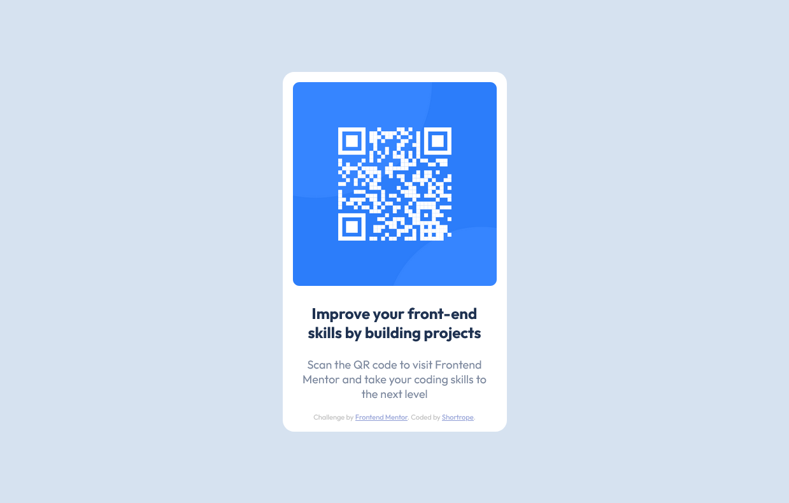

# Frontend Mentor - QR code component solution

This is a solution to the [QR code component challenge on Frontend Mentor](https://www.frontendmentor.io/challenges/qr-code-component-iux_sIO_H). Frontend Mentor challenges help you improve your coding skills by building realistic projects. 

## Table of contents

- [Screenshot](#screenshot)
- [Links](#links)
- [Built with](#built-with)
- [What I learned](#what-i-learned)
- [Author](#author)

## Overview

### Screenshot




### Links

- Solution URL: [qr-code-componet solution](https://github.com/Shortrope/FEM-QR-Code-Component)
- Live Site URL: [Add live site URL here](https://shortrope.github.io/FEM-QR-Code-Component/)


### Built with

- Basic HTML5 and CSS
- Flexbox


### What I learned

- Flexbox to center the component on the screen.
- @import fonts
- Used hsl colors for the first time


```css
@import url('https://fonts.googleapis.com/css2?family=Outfit:wght@400;700&display=swap');

body {
    background: hsl(212, 45%, 89%);
    display: flex;
    justify-content: center;
    align-items: center;
    height: 100vh;
    margin: 0;
    padding: 0;
}
```

## Author

- Website - [Shortrope.com](http://shortrope.com/)
- Frontend Mentor - [@shortrope](https://www.frontendmentor.io/profile/shortrope)

